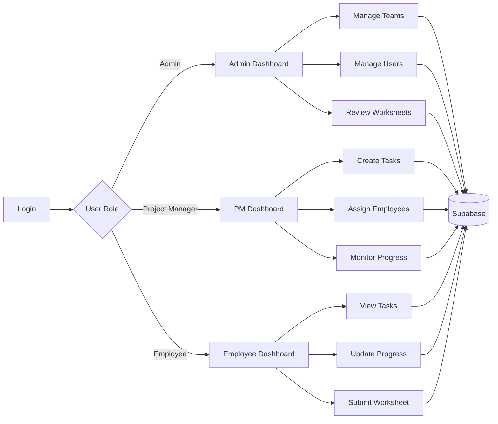

<div align="center">

# TASKFLOW


<br>


<br>


### A web-based project management and workforce tracking platform.

Manage projects, teams, employees, tasks, progress, worksheets, files, and activity from one system.

</div>

---

## Overview

**TaskFlow** is a project management application designed to coordinate work between:

- Administrators
- Project Managers
- Employees

It combines task assignment, progress monitoring, team management, worksheet reporting, file handling, and project activity tracking in a responsive web interface.

The application uses **HTML, CSS and JavaScript** on the frontend with **Supabase** providing database and backend services.

---

## Features

<table>
<tr>
<td width="50%">

### Task Management

- Create and assign tasks
- Set deadlines
- Set task priority
- Update task progress
- Track task status
- Monitor completion
- Maintain task history

</td>

<td width="50%">

### Team Management

- Create teams
- Manage departments
- Assign employees
- Allocate Project Managers
- View team members
- Organize project resources

</td>
</tr>

<tr>
<td width="50%">

### Worksheet System

- Submit daily worksheets
- Record work progress
- Record working hours
- Review employee reports
- Track worksheet history

</td>

<td width="50%">

### File Management

- Upload task files
- Attach project documents
- Preview uploaded files
- Manage reports
- Store files using Supabase

</td>
</tr>

<tr>
<td width="50%">

### Dashboard

- Task statistics
- Project progress
- Employee activity
- Team information
- Recent activities
- Status monitoring

</td>

<td width="50%">

### Role-Based Interface

Separate interfaces are available for:

- Administrator
- Project Manager
- Employee

Each role receives access to the tools relevant to its responsibilities.

</td>
</tr>
</table>

---

# Technology Stack

<div align="center">


</div>

| Technology | Purpose |
|---|---|
| HTML5 | Application structure |
| CSS3 | Styling and responsive interface |
| JavaScript | Application logic |
| Supabase | Backend and database |
| PostgreSQL | Relational data storage |
| Supabase Storage | File storage |
| Git | Version control |
| GitHub | Repository hosting |

---

# System Architecture

```text
                         TASKFLOW
                            │
              ┌─────────────┴─────────────┐
              │                           │
           Frontend                    Supabase
              │                           │
      ┌───────┼────────┐          ┌───────┼───────────┐
      │       │        │          │       │           │
    HTML     CSS   JavaScript  Database  Storage   Backend
      │                │
      │       ┌────────┴──────────┐
      │       │         │         │
      │     Admin       PM     Employee
      │
      └──────────── Web Browser
```

---

# User Roles

## Administrator

The Administrator controls the overall management environment.

**Capabilities**

- Manage employees
- Manage Project Managers
- Manage departments
- Manage teams
- Monitor projects
- View task information
- Review worksheets
- Monitor system activity

---

## Project Manager

Project Managers coordinate project execution and employee work.

**Capabilities**

- Create tasks
- Assign tasks
- Set deadlines
- Set priorities
- Monitor employee progress
- Review project work
- Track team activities

---

## Employee

Employees receive and update assigned work.

**Capabilities**

- View assigned tasks
- Update task progress
- Submit worksheets
- Upload project files
- View deadlines
- Track assigned work

---

# Project Structure

```text
Project-managment-Test/
│
├── index.html
├── admin.html
├── pm.html
├── employee.html
│
├── index.ts
│
├── styles.css
├── mobile.css
├── glass.css
├── profile.css
├── worksheet.css
│
├── js/
│   ├── admin.js
│   ├── admin-worksheets.js
│   ├── common.js
│   ├── data.js
│   ├── employee.js
│   ├── file-preview.js
│   ├── login.js
│   ├── notify.js
│   ├── pm.js
│   ├── profile.js
│   ├── state.js
│   ├── storage.js
│   ├── supabase.js
│   └── worksheet.js
│
├── 002_worksheets.sql
│
└── README.md
```

---

# Main JavaScript Modules

| File | Responsibility |
|---|---|
| `admin.js` | Administrator dashboard |
| `admin-worksheets.js` | Worksheet administration |
| `common.js` | Shared helper functions |
| `data.js` | Application data handling |
| `employee.js` | Employee dashboard |
| `file-preview.js` | File preview functionality |
| `login.js` | Authentication and login |
| `notify.js` | Notification functionality |
| `pm.js` | Project Manager dashboard |
| `profile.js` | User profile management |
| `state.js` | Application state |
| `storage.js` | File storage operations |
| `supabase.js` | Supabase connection |
| `worksheet.js` | Worksheet functionality |

---

# Getting Started

<details>

<summary><b>1. Clone the repository</b></summary>

<br>

```bash
git clone https://github.com/Alex-Learning-New/Project-managment-Test.git
```

Navigate into the project:

```bash
cd Project-managment-Test
```

</details>

---

<details>

<summary><b>2. Configure Supabase</b></summary>

<br>

Open:

```text
js/supabase.js
```

Configure your Supabase project credentials.

Example:

```javascript
const SUPABASE_URL = "YOUR_SUPABASE_URL";
const SUPABASE_ANON_KEY = "YOUR_SUPABASE_ANON_KEY";
```

Never commit private Supabase service-role keys to a public repository.

</details>

---

<details>

<summary><b>3. Configure the database</b></summary>

<br>

Open the **Supabase Dashboard**.

Go to:

```text
SQL Editor
```

Run the SQL files included with the project.

For example:

```text
002_worksheets.sql
```

Ensure that all tables required by the application have been created before running the project.

</details>

---

<details>

<summary><b>4. Run the project</b></summary>

<br>

Because the project uses JavaScript modules, running it through a local web server is preferable to opening the HTML file directly.

### VS Code Live Server

Open:

```text
index.html
```

Then select:

```text
Open with Live Server
```

### Python server

Alternatively:

```bash
python -m http.server 8000
```

Then open:

```text
http://localhost:8000
```

</details>

---

# Application Workflow



---

# Database

TaskFlow uses **Supabase PostgreSQL** as its primary database.

The application manages information related to areas such as:

```text
Users
│
├── Administrators
├── Project Managers
└── Employees

Projects
│
├── Teams
├── Tasks
├── Progress
├── Files
└── Worksheets
```

---

# Responsive Design

TaskFlow includes dedicated responsive styling through:

```text
mobile.css
```

The interface is designed to adapt across:

- Desktop
- Laptop
- Tablet
- Mobile

---

# Security

When deploying the application:

- Enable appropriate Supabase **Row Level Security**
- Define database access policies
- Protect sensitive credentials
- Never expose service-role keys
- Validate user input
- Restrict file upload permissions
- Configure Storage policies
- Use proper authentication for production systems

---

# Roadmap

```text
Current
  │
  ├── Task Management
  ├── Team Management
  ├── Worksheet Management
  ├── File Uploads
  └── Supabase Integration
  │
  ▼
Future
  │
  ├── Real-time Notifications
  ├── Email Automation
  ├── Calendar Integration
  ├── Gantt Charts
  ├── Advanced Analytics
  ├── Automated Reports
  ├── Workload Analysis
  └── Mobile Application
```

---

# Repository

<div align="center">

<a href="https://github.com/Alex-Learning-New/Project-managment-Test">

</a>

<br><br>

**TaskFlow**

Project Management • Team Collaboration • Workforce Tracking

<br>


</div>
